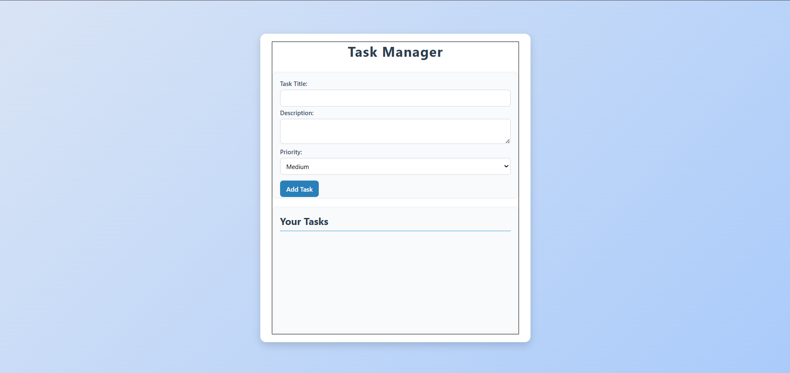
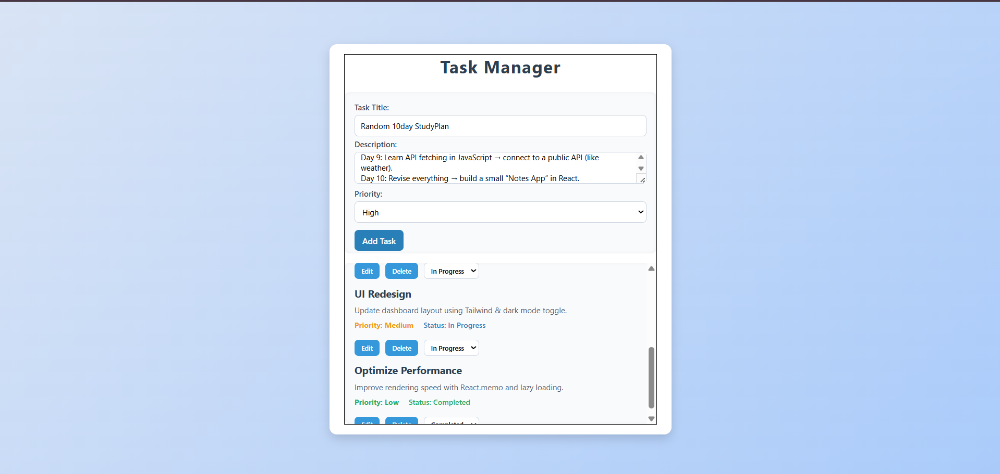

# Task-Manager-ReactBasic

**A forward-focused, no-BS task management app built with React & Redux Toolkit.**

Easily create, update, delete, and manage your tasks in a clean, user-friendly interface.

---

## 🚀 Live Demo

Check out the working app live at: **[https://task-manager-react-basic.vercel.app/](https://task-manager-react-basic.vercel.app/)**

---

##  Features

- **Add, Edit & Delete Tasks** — Simple and intuitive task CRUD operations.
- **Task Completion** — Mark tasks as done with ease.
- **Responsive UI** — Built with Bootstrap for seamless use on mobile and desktop.
- **Clean UX** — Minimalist design that keeps you focused.
-**Priority**- You can add task with High,Mediumm and Low priority.
---

##  Tech Stack

- **React** — UI components and state.
- **Redux Toolkit** — Efficient state management and slices.
- **Bootstrap** — Layout and styling for mobile-first responsiveness.

---

## 📷 Screenshots

### Home Page


### Task List with Priority


---
##  Installation

1. Clone your project:
   ```bash
   git clone https://github.com/Darkfalcon2804/Task-Manager-ReactBasic-.git
   cd src
   ```
 2. Install dependencies:
   ```bash
   npm install
   ```
   3. Run the app locally:

```bash
npm run dev

